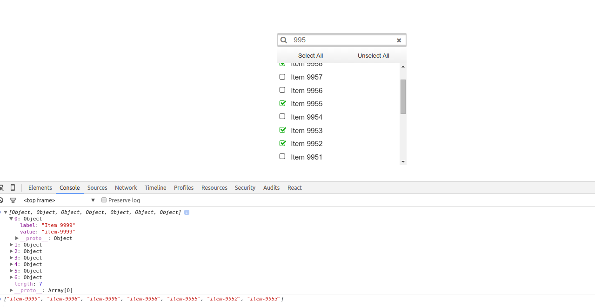

# ProperSearch

[](https://travis-ci.org/CBIConsulting/ProperSearch)

A proper search component for react. With a search field and a list of items allows the user to filter that list and select the items. The component return the
selected data when it get selected. Allows multi and single selection. The list is virtual rendered, was designed to handle thousands of items without sacrificing
performance, only render the items in the view. Use react-virtualized to render the list items. This component has a lot of configurable settings, read the
component properties section for more info.

Used technologies:

- React
- ES6
- Webpack
- Babel
- Node
- Compass
- Jasmine
- Karma


Features of ProperSearch:

* Data selection allowed from a list
* List filtering on search
* Allow multi and single selection
* Return the selection
* List virtual rendered


The compile and compressed ProperSearch distribution file can be found in the dist folder along with the css file. Add the default stylesheet `dist/propersearch.min.css`, then import it into any module.

## Live Demo
##### [Code](https://github.com/CBIConsulting/ProperSearch/tree/gh-pages/examples/jsx/app.js)
##### [Demo](http://cbiconsulting.github.io/ProperSearch/)


## External dependencies
* React and React DOM
* Underscore


## Preview


## Use this module in your projects
```
npm install react-propersearch --save
```

## How to start

Run:
```
npm install
npm start
```

Check your http://localhost:8080/ or  `open http://localhost:8080/`

## How to test

`npm test`

### Component properties
* data: List data. (Array)
 	* value: Id name. (String)
 	* label: Name to show (String)
* messages: Get the translated messages of the lang selected in the property lang. Default ENG (An example can be found in src/lang)
	* Default:
	```javascript
		'ENG': {
			all: 'Select All',
			none: 'Unselect All',
			loading: 'Loading...',
			noData:'No data found'
		}
	```
* lang: Language for the messages (String)
* defaultSelection: Items of the list selected by default. (React eS6 Set) Default new Set()
* multiSelect: Type of the selection, multiple or single (Boolean)
* listWidth: Custom width for the list under the search field (Integer) Default component's width.
* listHeight: Height of the list. Default 200 (Integer)
* listRowHeight: Height of each row of the list
* afterSelect: Function called after select a row. Return the seleted rows.
	* Ex:
	```javascript
		afterSelect ={
			function(data, selection){
				console.info(data); // Selected data
				console.info(selection); // Array of selected values
			}
		}
	```
* afterSearch: Function called after type something into the search field. Return the written string.
	* Ex:
	```javascript
		afterSearch={
			function(search_string) {
				console.info('Filtering by: ', search_string);
			}
		}
	```
* afterSelectGetSelection: Function called after select a row. This one works same as afterSelec(data, selection) but this one is faster because doesn't work over data, only get selection instead
	* Ex:
	```javascript
		afterSelectGetSelection={
			function(selectionAsArray, selectionAsSetObj) {
				console.info(selectionAsArray); // Array of selected values (idField)
				console.info(selectionAsSetObj); // Set object which contains selected values (idField)
			}
		}
	```
* fieldClass: ClassName for the search field (String)
* listClass: ClassName for the list (String)
* listElementClass: ClassName for each element of the list (String)
* className: ClassName for the component container (String)
* placeholder: Placeholder for the search field (String) Default 'Search...'
* searchIcon: ClassName for the search icon in the left of the search field (String) Default 'fa fa-search fa-fw' (FontAwesome)
* clearIcon: ClassName for the clear icon inside the clear button in the right side of the search field. (String) Default 'fa fa-times fa-fw' (FontAwesome)
* throttle: Time between filtering action and the next. It affects to the search field onChange method setting an timeout (Integer) Default 160
* minLength: Min. length of the written string in the search field to start filtering. (Integer) Default 3
* onEnter: Custom function to be called on Enter key up.
* idField: Name of the field that will be used to build the selection. Default 'value'
	* Ex:
	```javascript
		let data = [];
		data.push(value:'3', label: 'Orange', price: '9', kg: 200);

		<Search
			...
			idField='value'
			...
		/>

		Selecting Orange you ill get a selection -> [3] and data -> [{value:'3', label: 'Orange', price: '9', kg: 200}]
	```
* displayField: Field of the data which should be used to display in each element of the list. It can be a string or a function, just remenber to set the showIcon property to false if you are using another component and then only that component will be rendered inside each list element. Default: 'label'.
	* Ex:
	```javascript
		let buttonClick = (e, name) => {
			alert('Button ' + name + ' has been clicked');
		}

		let formater = listElement => {
			return <button className ="btn btn-default" onClick={ (e) => {buttonClick(e, listElement.name)} }>{ listElement.name }</button>;
		}

		let data = [];
		data.push(id:'16', display: formater, name: 'test 1');

		<Search
			...
			idField={'id'}
			displayField={'display'}
			...
		/>
	```
* listShowIcon: Setting if the check icon on the left of each list element must be printed or not
* autoComplete: If the search field has autocomplete 'on' or 'off'. Default 'off'
* defaultSearch: Set a default searching string to search when the components get mounted or this prop is updated.
* filterField: Field to use for filtering on search field change.
* filter: Function used to filter on type something in the search field. By default the data will be filtered by its displayfield, if it's a function then by it's name, if it doesn't exist then by its idField. (Important: If filterField it's set up then the data will by filter by this field). Note: if you use the filter then you'll get each element of list and the search field value, then you can filter that in the way you wanted). The search value it's normalized.
	* Ex:
	```javascript
	let filter = (listElement, searchValue) => {
		let data = listElement.name.toLowerCase();
		data = Normalizer.normalize(data);
		return data.indexOf(searchValue) >= 0;
	}

	let buttonClick = (e, name) => {
		alert('Button ' + name + ' has been clicked');
	}

	let formater = listElement => {
		return <button className ="btn btn-default" onClick={ (e) => {buttonClick(e, listElement.name)} }>{ listElement.name }</button>;
	}

	let data = [];
	data.push(id:'16', display: formater, name: 'test 1');

	<Search
		...
		idField={'id'}
		displayField={'display'}
		filter={filter}
		...
	/>
```


### Basic Example

```javascript
import React from 'react';
import ReactDOM from 'react-dom';
import ProperSearch from 'react-propercombo';

// Function Called after select items in the list.

const afterSelect = (data, selection) => {
	console.info(data);
	console.info(selection);
}

// List data
const data = [];

for (var i = 10000; i >= 0; i--) {
	data.push({value: 'item-' + i, label: 'Item ' + i});
}

// Render the Search component
ReactDOM.render(
	<Search
		data={data}
		multiSelect={true}
		afterSelect={afterSelect}
	/>,
	document.getElementById('example')
);
```


Contributions
------------

Use [GitHub issues](https://github.com/CBIConsulting/ProperSearch/issues) for requests.

Changelog
---------

Changes are tracked as [GitHub releases](https://github.com/CBIConsulting/ProperSearch/releases).
